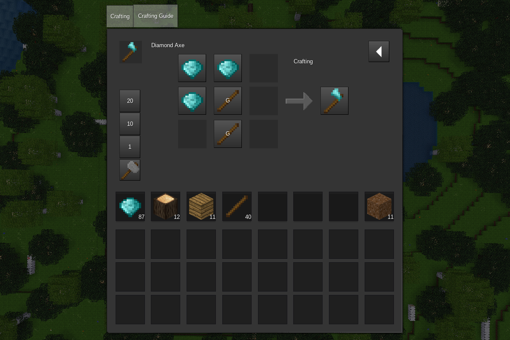

# Crafting Guide Plus

[](https://content.minetest.net/packages/random_geek/cg_plus/)



Crafting Guide Plus is a simple and intuitive crafting guide and auto-crafting mod for Minetest. CGP is compatible with
Minetest Game and any other games that use sfinv. It was built mostly from the ground up, with some inspiration from
jp's Crafting Guide, Unified Inventory, and Minetest Game's builtin crafting guide.

Note: If `mtg_craftguide` is present, CGP will override its page in the inventory. You may want to remove
`mtg_craftguide` entirely for optimization purposes.

## Features:

- "Intelligent" auto-crafting, or rather, automatic craft staging. This feature can be disabled if it is not wanted.
- Group support, including group search and support for craft recipes requiring items in multiple groups.
- Shaped and shapeless crafting recipe previews of any size.
- Fuel and cooking recipes, including fuel replacements and burning/cooking times.
- Digging and digging by chance (item drop) previews.

## Known issues:

- The auto-crafting algorithm is not *perfect*. For craft recipes requiring items in a group, only the item with the
greatest count from the player's inventory will be utilized.
- Items in multiple groups will not always display correctly in craft view.

## License

Code is licensed under the GNU LGPL v3.0. Images and other media are CC BY-SA 4.0 unless otherwise noted.

The following images are from Minetest Game, and their respective licenses apply:

```
cg_plus_icon_autocrafting.png    Adapted from default_tool_stonepick.png
cg_plus_icon_cooking.png         From default_furnace_front_active.png
cg_plus_icon_digging.png         From default_tool_stonepick.png
cg_plus_icon_fuel.png            From default_furnace_fire_fg.png
```
